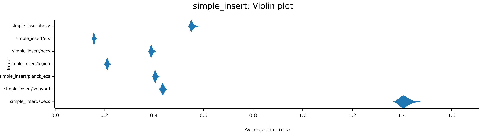
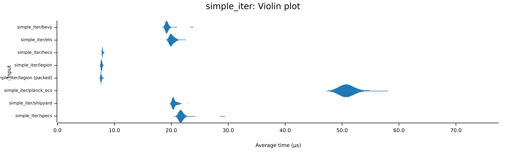
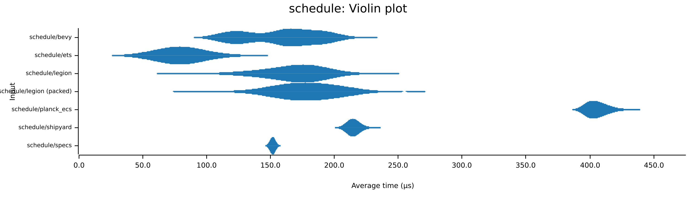
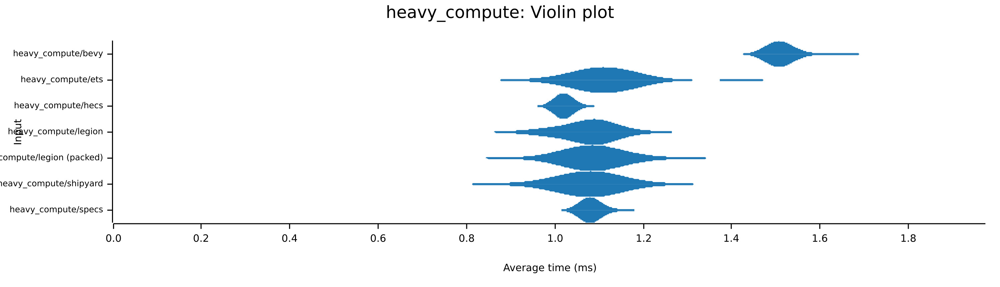
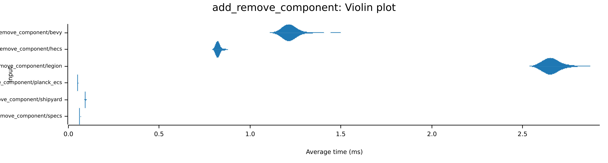
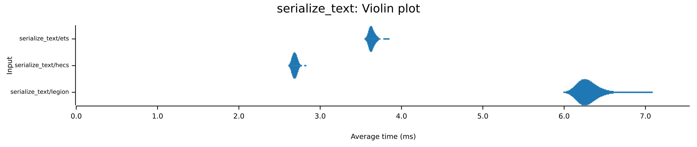
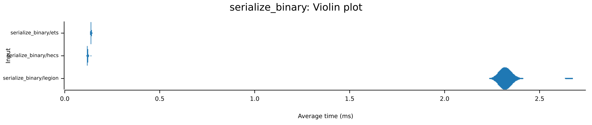

# ECS Bench Suite

Forked from [ecs_bench_suite](https://github.com/rust-gamedev/ecs_bench_suite), adding [ETS](https://github.com/jagprog5/ets).

## The Benchmarks

### Simple Insert

This benchmark is designed to test the base cost of constructing entities and moving components into the ECS.

Inserts 10,000 entities, each with 4 components: `Transform(mat4x4)`, `Position(vec3)`, `Rotation(vec3)` and `Velocity(vec3)`.

### Simple Iter

This benchmark is designed to test the core overheads involved in component iteration in best-case conditions. The iteration should occur on a single CPU core.

Dataset: 10,000 entities, each with 4 components: `Transform(mat4x4)`, `Position(vec3)`, `Rotation(vec3)` and `Velocity(vec3)`.

Test: Iterate through all entities with `Position` and `Velocity`, and add velocity onto position.

### Fragmented Iter

This benchmark is designed to test how the ECS handles iteration through a fragmented dataset. The iteration should occur on a single CPU core.

Dataset: 26 component types (`A(f32)` through `Z(f32)`), each with 20 entities plus a `Data(f32)` component.

Test: Iterate through all entities with a `Data` component and double its value.

### System Scheduling

This benchmark is designed to test how efficiently the ECS can schedule multiple independent systems on a multi-core CPU. This is primarily an outer-parallelism test. Each system should execute on a single CPU core.

Dataset:

* 10,000 entities with `(A, B)` components.
* 10,000 entities with `(A, B, C)` components.
* 10,000 entities with `(A, B, C, D)` components.
* 10,000 entities with `(A, B, C, E)` components.

Test:

Three systems accessing the following components mutably, where each system swaps the values stored in each component:

* `(A, B)`
* `(C, D)`
* `(C, E)`

### Heavy Compute

This benchmark is designed to test the ECS's ability to scale when it is allowed to run a system over multiple CPU cores. This is primarily an inner-parallelism test.

Dataset: 1,000 entities with a `mat4x4` component.

Test: Iterate through all `mat4x4` components, and invert the matrix 100 times.

### Add/Remove Component

This benchmark is designed to test how quickly the ECS can add and then remove a component from an existing entity.

Dataset: 10,000 entities with a single `A` component.

Test: Iterate through all entities, adding a `B` component. Then iterate through all entities again, removing their `B` component.

### Serialize

This benchmark is designed to test how quickly the ECS and serialize and deserialize its entities in both text (RON) and binary (bincode) formats.

Dataset: 1000 entities with `Transform(mat4x4)`, `Position(vec3)`, `Rotation(vec3)` and `Velocity(vec3)` components.

Test: Serialize all entities to RON and bincode formats in-memory. Then deserialize back into the ECS. The RON and bincode formats should be separate benchmark tests.

